# Hi, I'm Saud 👋

**Full-Stack Developer** at [Script Vortex](https://www.scriptvortex.com/) — building modern web and mobile applications with clean code and thoughtful design.

I'm passionate about building full product ecosystems — mobile apps, web platforms, admin panels, and desktop tools — across the **MERN stack**, **React Native**, **Expo**, and **Electron**. Open to collaboration and new opportunities.

---

## 🛠 Tech Stack

**Frontend**

**Backend & Data**

**Tools & DevOps**

---

## 🚀 Featured Projects

### [Cafe Expo](https://app.cafeexpo.pt/)
End-to-end café management platform for ordering, operations, and point-of-sale.

**Platforms:** Client App · Employee App · Web App · Admin Panel · POS (Electron)

---

### [Salsivo](https://app.salsivodanceapp.com/)
Dance studio platform for class management, bookings, and member engagement.

**Platforms:** Mobile App · Admin Panel · Web App

---

### [KickBack](https://app.httpskickbackguys.com/)
Full-stack rewards and loyalty platform connecting businesses with their customers.

**Platforms:** Mobile App · Admin Panel · Web App

---

### [MySendTiments](https://mysendtiments.com/)
Mobile app for sending personalized sentiments and digital greetings.

**Platforms:** Mobile App

---

## 📊 GitHub Stats

  
  

  

---

## 📫 Connect With Me

---

  

<picture>
  <source media="(prefers-color-scheme: dark)" srcset="./dist/github-contribution-grid-snake-dark.svg">
  <source media="(prefers-color-scheme: light)" srcset="./dist/github-contribution-grid-snake.svg">
  
</picture>
